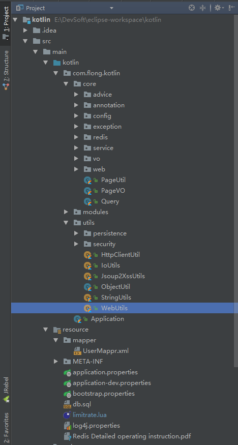
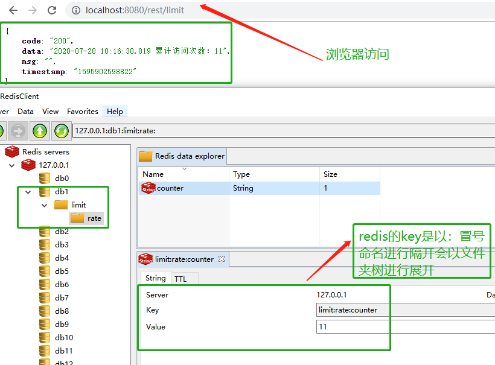
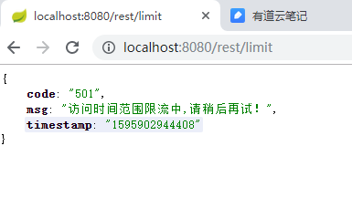

### 1、Redis是简介

*  [redis官方网](https://redis.io/)

*  Redis是一个开源的使用ANSI [C语言](http://baike.baidu.com/view/1219.htm)编写、支持网络、可基于内存亦可持久化的日志型、Key-Value[数据库](http://baike.baidu.com/view/1088.htm)，并提供多种语言的API。从2010年3月15日起，Redis的开发工作由VMware主持。从2013年5月开始，Redis的开发由Pivotal赞助

* 工程基于基础架构 [Kotlin +SpringBoot + MyBatis完美搭建最简洁最酷的前后端分离框架](https://www.jianshu.com/p/0acd593fd11e)进行完善


### 2、Redis开发者
*  redis 的作者，叫Salvatore Sanfilippo，来自意大利的西西里岛，现在居住在卡塔尼亚。目前供职于Pivotal公司。他使用的网名是antirez。

### 3、Redis安装
* Redis安装与其他知识点请参考几年前我编写文档 `Redis Detailed operating instruction.pdf`，这里不做太多的描述，主要讲解在kotlin+SpringBoot然后搭建Redis与遇到的问题
> [Redis详细使用说明书.pdf](https://github.com/jilongliang/kotlin/blob/dev-redis/src/main/resource/Redis%20Detailed%20operating%20instruction.pdf)


### 4、Redis应该学习那些？
* 列举一些常见的内容


### 5、Redis有哪些命令
>[Redis官方命令清单](https://redis.io/commands)
* Redis常用命令


### 6、 Redis常见应用场景


### 7、 Redis常见的几种特征
* Redis的哨兵机制
* Redis的原子性
* Redis持久化有RDB与AOF方式

### 8、工程结构
* 
* 

### 9、Kotlin与Redis+Lua的代码实现

> [Kotlin与Redis实现文章请参考](https://www.jianshu.com/p/49cb540f9c91)

* ##### Redis 依赖的Jar配置
```
<!-- Spring Boot Redis 依赖 -->
<dependency>
	<groupId>org.springframework.boot</groupId>
	<artifactId>spring-boot-starter-data-redis</artifactId>
</dependency>

<dependency>
	<groupId>redis.clients</groupId>
	<artifactId>jedis</artifactId>
</dependency>
```
* ##### LuaConfiguration 
* 设置加载限流lua脚本
```
@Configuration
class LuaConfiguration {
    @Bean
    fun redisScript(): DefaultRedisScript<Number> {
        val redisScript = DefaultRedisScript<Number>()
        //设置限流lua脚本
        redisScript.setScriptSource(ResourceScriptSource(ClassPathResource("limitrate.lua")))
        //第1种写法反射转换Number类型
        //redisScript.setResultType(Number::class.java)
        //第2种写法反射转换Number类型
        redisScript.resultType = Number::class.java
        return redisScript
    }
}
``` 
* Lua限流脚本
```
local key = "request:limit:rate:" .. KEYS[1]    --限流KEY
local limitCount = tonumber(ARGV[1])            --限流大小
local limitTime = tonumber(ARGV[2])             --限流时间
local current = tonumber(redis.call('get', key) or "0")
if current + 1 > limitCount then --如果超出限流大小
    return 0
else  --请求数+1，并设置1秒过期
    redis.call("INCRBY", key,"1")
    redis.call("expire", key,limitTime)
    return current + 1
end

```


* #### RateLimiter自定义注解
* 1、Java自定义注解Target使用`@Target(ElementType.TYPE, ElementType.METHOD)`
* 2、Java自定义注解Retention使用`@Retention(RetentionPolicy.RUNTIME)`
* 3、Kotlin自定义注解Target使用`@Target(AnnotationTarget.TYPE, AnnotationTarget.FUNCTION)`
* 4、Kotlin自定义注解Target使用`@Retention(AnnotationTarget.TYPE, AnnotationTarget.FUNCTION)`
```

@Target(AnnotationTarget.TYPE, AnnotationTarget.FUNCTION)
@Retention(AnnotationRetention.RUNTIME)
annotation class RateLimiter(
        /**
         * 限流唯一标识
         * @return
         */
        val key: String = "",
        /**
         * 限流时间
         * @return
         */
        val time: Int,
        /**
         * 限流次数
         * @return
         */
        val count: Int
 )
```
 
### 限流AOP的Aspect切面实现
```
import com.flong.kotlin.core.annotation.RateLimiter
import com.flong.kotlin.core.exception.BaseException
import com.flong.kotlin.core.exception.CommMsgCode
import com.flong.kotlin.core.vo.ErrorResp
import com.flong.kotlin.utils.WebUtils
import org.aspectj.lang.ProceedingJoinPoint
import org.aspectj.lang.annotation.Around
import org.aspectj.lang.annotation.Aspect
import org.aspectj.lang.reflect.MethodSignature
import org.slf4j.Logger
import org.slf4j.LoggerFactory
import org.springframework.beans.factory.annotation.Autowired
import org.springframework.context.annotation.Configuration
import org.springframework.data.redis.core.RedisTemplate
import org.springframework.data.redis.core.script.DefaultRedisScript
import org.springframework.web.context.request.RequestContextHolder
import org.springframework.web.context.request.ServletRequestAttributes
import java.util.*


@Suppress("SpringKotlinAutowiring")
@Aspect
@Configuration
class RateLimiterAspect {
    @Autowired lateinit var redisTemplate: RedisTemplate<String, Any>
    @Autowired var redisScript: DefaultRedisScript<Number>? = null

    /**
     * 半生对象
     */
    companion object {
        private val log: Logger = LoggerFactory.getLogger(RateLimiterAspect::class.java)
    }

    @Around("execution(* com.flong.kotlin.modules.controller ..*(..) )")
    @Throws(Throwable::class)
    fun interceptor(joinPoint: ProceedingJoinPoint): Any {

        val signature = joinPoint.signature as MethodSignature
        val method = signature.method
        val targetClass = method.declaringClass
        val rateLimit = method.getAnnotation(RateLimiter::class.java)

        if (rateLimit != null) {
            val request = (RequestContextHolder.getRequestAttributes() as ServletRequestAttributes).request
            val ipAddress = WebUtils.getIpAddr(request = request)

            val stringBuffer = StringBuffer()
            stringBuffer.append(ipAddress).append("-")
                    .append(targetClass.name).append("- ")
                    .append(method.name).append("-")
                    .append(rateLimit!!.key)

            val keys = Collections.singletonList(stringBuffer.toString())

            print(keys + rateLimit!!.count + rateLimit!!.time)
            val number = redisTemplate!!.execute<Number>(redisScript, keys, rateLimit!!.count, rateLimit!!.time)

            if (number != null && number!!.toInt() != 0 && number!!.toInt() <= rateLimit!!.count) {
                log.info("限流时间段内访问第：{} 次", number!!.toString())
                return joinPoint.proceed()
            }

        } else {
            var proceed: Any? = joinPoint.proceed() ?: return ErrorResp(CommMsgCode.SUCCESS.code!!, CommMsgCode.SUCCESS.message!!)
            return joinPoint.proceed()
        }
        throw BaseException(CommMsgCode.RATE_LIMIT.code!!, CommMsgCode.RATE_LIMIT.message!!)
    }


}

```
 
* #### Controller代码
```
 @RestController
 @RequestMapping("rest")
 class RateLimiterController {
     companion object {
         private val log: Logger = LoggerFactory.getLogger(RateLimiterController::class.java)
     }
 
     @Autowired
     private val redisTemplate: RedisTemplate<*, *>? = null
 
     @GetMapping(value = "/limit")
     @RateLimiter(key = "limit", time = 10, count = 1)
     fun limit(): ResponseEntity<Any> {
 
         val date = DateFormatUtils.format(Date(), "yyyy-MM-dd HH:mm:ss.SSS")
         val limitCounter = RedisAtomicInteger("limit:rate:counter", redisTemplate!!.connectionFactory!!)
         val str = date + " 累计访问次数：" + limitCounter.andIncrement
         log.info(str)
 
         return ResponseEntity.ok<Any>(str)
     }
 }
```

> 注意：RedisTemplateK, V>这个类由于有K与V，下面的做法是必须要指定Key-Value 2 type arguments expected for class RedisTemplate
* #### 运行结果
* 
* 
 
# 10、参考文章
> [参考分布式限流之Redis+Lua实现](https://www.jianshu.com/p/d2109a3068df)
> [参考springboot + aop + Lua分布式限流的最佳实践](https://www.cnblogs.com/youngdeng/p/12883831.html)


# 11、工程架构源代码
> [Kotlin+SpringBoot与Redis+Lua整合工程源代码](https://github.com/jilongliang/kotlin/tree/dev-lua)


# 12 、总结与建议
* 1 、以上问题根据搭建 kotlin与Redis实际情况进行总结整理，除了技术问题查很多网上资料，通过自身进行学习之后梳理与分享。

* 2、 在学习过程中也遇到很多困难和疑点，如有问题或误点，望各位老司机多多指出或者提出建议。本人会采纳各种好建议和正确方式不断完善现况，人在成长过程中的需要优质的养料。

* 3、 希望此文章能帮助各位老铁们更好去了解如何在 kotlin上搭建RabbitMQ，也希望您看了此文档或者通过找资料进行手动安装效果会更好。

> 备注：此文章属于本人原创,欢迎转载和收藏.

